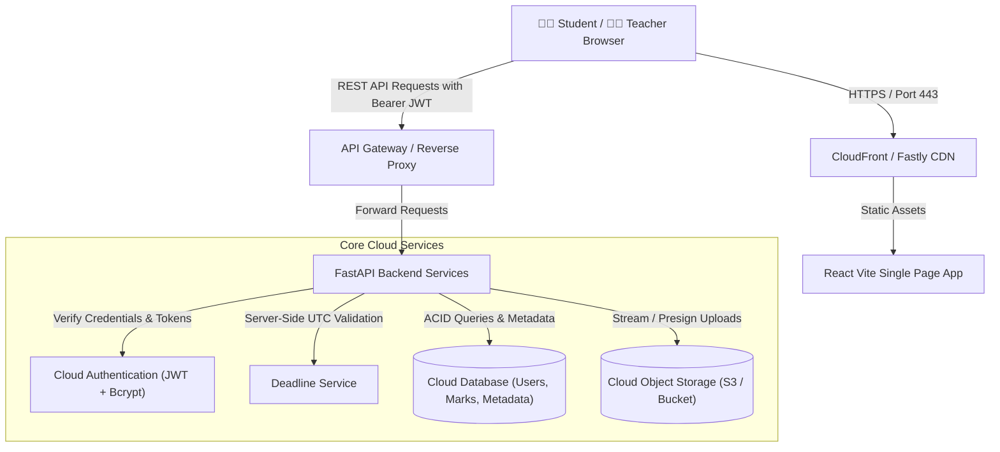

# Cloud-Based Student Assignment Submission & Feedback Portal

[](https://www.python.org/)
[](https://fastapi.tiangolo.com/)
[](https://react.dev/)
[]()
[-brightgreen.svg)]()
[]()

> An industry-oriented, multi-tier Cloud Computing portal enabling students to upload coursework to Cloud Object Storage, instructors to review and grade submissions centrally, and both parties to track feedback and revisions in real time with server-side deadline validation and role-based access control.

---

## 📑 Table of Contents
1. [Overview](#overview)
2. [Problem Statement](#problem-statement)
3. [Objectives](#objectives)
4. [Industry Relevance & Business Benefits](#industry-relevance--business-benefits)
5. [User Roles & RBAC Matrix](#user-roles--rbac-matrix)
6. [Cloud Computing Concepts Used](#cloud-computing-concepts-used)
7. [System Architecture](#system-architecture)
8. [Technology Stack](#technology-stack)
9. [Database Design & Schema](#database-design--schema)
10. [Cloud Object Storage Design](#cloud-object-storage-design)
11. [Authentication & Authorization](#authentication--authorization)
12. [Assignment & Submission Workflows](#assignment--submission-workflows)
13. [Deadline Logic & Server-Side Rules](#deadline-logic--server-side-rules)
14. [Feedback & Grading Engine](#feedback--grading-engine)
15. [REST API Documentation](#rest-api-documentation)
16. [Folder Structure](#folder-structure)
17. [Local Simulation & Step-by-Step Setup](#local-simulation--step-by-step-setup)
18. [Cloud Deployment Strategy](#cloud-deployment-strategy)
19. [Testing Strategy (25 Test Scenarios)](#testing-strategy)
20. [Cloud Security Controls](#cloud-security-controls)
21. [Scalability to 100,000 Concurrent Students](#scalability)
22. [Failure Handling & Resiliency](#failure-handling--resiliency)
23. [Interview Preparation Guide (10 Questions & Answers)](#interview-preparation-guide)
24. [Resume & LinkedIn Proof Content](#resume--linkedin-proof)

---

## Overview

The **Cloud-Based Student Assignment Submission & Feedback Portal** is a production-style educational SaaS application designed to demonstrate essential cloud engineering patterns. Rather than treating file uploads as simple web forms stored in a local directory, this platform decouples **structured metadata** (stored in a cloud relational database) from **unstructured binary files** (stored in cloud object storage).

The portal addresses the real-world operational challenges faced by universities, online bootcamps, and enterprise learning management systems (e.g., Canvas, Blackboard, Google Classroom) during assignment deadlines.

---

## Problem Statement

Traditional academic assignment workflows face critical bottlenecks:
- **Scattered Submissions:** Students submit via email, external drives, or messaging platforms, leading to lost attachments and chaotic tracking.
- **Unreliable Timestamps:** Client-side timestamp manipulation allows fraudulent "on-time" claims.
- **Database Bloat & I/O Starvation:** Storing large PDF/ZIP files as `BLOB` fields in relational databases degrades query performance, inflates backup size, and crashes application pools during deadline surges.
- **Security Vulnerabilities:** Publicly exposed upload directories or unauthenticated download URLs allow unauthorized students to read or tamper with peers' homework.
- **Slow Evaluation Cycles:** Lack of centralized grading tools delays feedback, hampering academic outcomes.

---

## Objectives

1. **Storage Decoupling:** Store assignment metadata in a managed database while isolating binaries in Cloud Object Storage.
2. **Server-Side Deadline Enforcement:** Compare immutable UTC server timestamps against assignment deadlines, eliminating client-side clock tampering.
3. **Role-Based Access Control (RBAC):** Protect student privacy such that students can only access their own submissions and feedback, while teachers can manage courses and issue grades.
4. **Resubmission & Version Tracking:** Automatically track versions (`v1`, `v2`, etc.) when students revise submissions before deadlines.
5. **Multi-Cloud and Free-Tier Portability:** Provide zero-cost local simulation with straightforward configuration switches to AWS S3, Supabase, or Google Cloud Storage.

---

## Industry Relevance & Business Benefits

Cloud submission portals power platforms across multiple global sectors:
- **Higher Education:** Canvas, Blackboard, Moodle, Google Classroom.
- **Corporate Training:** Degreed, Workday Learning, Cornerstone OnDemand.
- **Tech Bootcamps & Coding Academies:** Scalable submission and automated code/lab review.

### Key Business Benefits
- **Centralized Data:** Eliminates paper trails and provides an auditable history of academic integrity.
- **High Availability & Anywhere Access:** Cloud-hosted web architecture allows 24/7 access from any device without local server dependencies.
- **Cost Efficiency:** Object storage is up to 10x cheaper per gigabyte than relational database storage disks.
- **Elastic Scale:** Accommodates sudden 100x traffic spikes 15 minutes before an 11:59 PM deadline.

---

## User Roles & RBAC Matrix

| Feature / Action | Student | Teacher / Faculty | Admin |
| :--- | :---: | :---: | :---: |
| Self-Register & Log In |  |  |  |
| View Assigned Coursework & Deadlines |  |  |  |
| Upload Assignment File (PDF, DOCX, ZIP) |  | ❌ | ❌ |
| View Own Submissions & Download Own File |  | ❌ | ❌ |
| View Peer's Submissions or Download Peer File | ❌ (403 Forbidden) | ❌ | ❌ |
| View Awarded Marks & Written Feedback |  |  |  |
| Create & Publish New Course Assignment | ❌ (403 Forbidden) |  |  |
| View All Student Submissions for Course | ❌ (403 Forbidden) |  |  |
| Download Student Submissions for Review | ❌ (403 Forbidden) |  |  |
| Enter Marks & Submit Written Feedback | ❌ (403 Forbidden) |  |  |
| Update / Delete Assignments | ❌ (403 Forbidden) |  (Creator Only) |  |

---

## Cloud Computing Concepts Used

| Cloud Computing Concept | Where It Appears in This Project |
| :--- | :--- |
| **SaaS (Software-as-a-Service)** | The complete web portal delivered through the browser for students and teachers. |
| **PaaS (Platform-as-a-Service)** | Application hosting on platforms like AWS App Runner, Render, or Railway without VM maintenance. |
| **IaaS (Infrastructure-as-a-Service)** | Containerization via Docker and cloud-provisioned virtual networking/storage. |
| **Cloud Database** | PostgreSQL/SQLite instance storing users, courses, assignments, and submission metadata. |
| **Cloud Object Storage** | S3 / MinIO / Local Bucket storing binary artifacts with unique hierarchical object keys. |
| **Authentication & RBAC** | JWT (JSON Web Tokens) with cryptographically verified roles (`student`, `teacher`). |
| **REST APIs** | Standardized HTTP interface connecting the React SPA to the FastAPI backend. |
| **Serverless Scalability** | Decoupling file I/O from compute allows horizontal auto-scaling during deadline spikes. |
| **Signed / Private URLs** | Restricting direct bucket downloads so files can only be accessed through authorized streams. |
| **Environment Variables** | Secrets and bucket names isolated in `.env` rather than committed to source control. |
| **Health Probes** | `/api/health` probe endpoint for Cloud Load Balancers and container orchestrators. |

---

## System Architecture



### End-to-End Workflow Diagram
```
Teacher Creates Assignment
       ↓
Saved in Cloud Database
       ↓
Student Dashboard Displays Assignment & Countdown
       ↓
Student Uploads Assignment File
       ↓
Backend Validates File (Type, Size, Deadline)
       ↓
Binary Uploaded to Cloud Object Storage: assignments/{aid}/{uid}/v1_file.pdf
       ↓
Submission Metadata Recorded in Cloud Database
       ↓
Teacher Reviews Submission & Downloads File
       ↓
Teacher Inputs Marks & Feedback
       ↓
Cloud Database Updates (Status: GRADED)
       ↓
Student Receives Real-Time Grade & Feedback
```

---

## Technology Stack

### Recommended Student & Production Stack (Option B)
- **Frontend:** React 18, Vite, Lucide React, Modern Glassmorphism CSS theme.
- **Backend:** Python 3.11+, FastAPI (high performance ASGI framework).
- **Database:** SQLAlchemy 2.0 ORM with SQLite (local development) / PostgreSQL / Supabase (cloud).
- **Cloud Storage:** Modular `CloudStorageProvider` interface (Local Bucket store for free-tier simulation; AWS S3 / Supabase Storage ready).
- **Authentication:** JWT HS256 with Bcrypt password hashing.
- **Testing:** Pytest & FastAPI HTTPX TestClient (25 automated test cases).

---

## Database Design & Schema

### Entity Relationship Diagram
```
  [USERS] 1 ────────── * [COURSES] (Teacher)
     │ 1
     │
     ├───────────────── * [ASSIGNMENTS] (Creator)
     │                       │ 1
     │                       │
     └───────────────── * [SUBMISSIONS] * ────────── 1 [ASSIGNMENTS]
       (Student & Grader)
```

### Why Assignment Files Must NEVER Be Stored as Database BLOBs
1. **Database Bloat:** Relational databases cache entire pages into RAM. Storing 20MB PDFs fills memory buffers with binary data rather than indexable rows.
2. **Backup Inefficiency:** A 100GB database backup takes hours to dump and restore, whereas object storage handles backups natively with automatic multi-AZ redundancy.
3. **Connection Starvation:** Streaming large files directly through a database connection pool holds open database connections for seconds, exhausting connection limits.

---

## Cloud Object Storage Design

Storage is organized into an isolated, structured bucket hierarchy:
```
cloud_storage_bucket/
└── assignments/
    ├── {assignment_id_1}/
    │   ├── {student_id_1}/
    │   │   ├── v1_solution.pdf
    │   │   └── v2_solution_revised.pdf
    │   └── {student_id_2}/
    │       └── v1_report.docx
    └── {assignment_id_2}/
        └── ...
```

### Security & Access
- The object storage bucket is **strictly private** (no public internet read permissions).
- File requests pass through authenticated endpoints (`/api/submissions/{id}/download`) that check whether the requesting user is the student owner or the course instructor.
- Filenames are sanitized with regex to prevent directory traversal (`../../etc/passwd`).

---

## Deadline Logic & Server-Side Rules

```
IF (current_server_utc_time <= assignment_deadline_utc):
    submission_status = "SUBMITTED"
ELSE:
    IF (assignment.allow_late_submissions == True):
        submission_status = "LATE"
    ELSE:
        REJECT with HTTP 400 ("Late submissions are disabled for this assignment.")
```

> **Why Client-Side Clocks Cannot Be Trusted:**
> If deadline validation relied on the student's browser clock, any user could change their operating system time backwards to submit past the deadline. This portal strictly uses `datetime.now(timezone.utc)` evaluated by the backend server.

---

## REST API Documentation

| HTTP Method | Endpoint | Role Required | Purpose |
| :--- | :--- | :--- | :--- |
| `POST` | `/api/auth/register` | Public | Create new student or teacher account |
| `POST` | `/api/auth/login` | Public | Authenticate and obtain JWT access token |
| `GET` | `/api/auth/me` | Authenticated | Fetch current user session profile |
| `POST` | `/api/auth/logout` | Authenticated | Sign out and invalidate client session |
| `GET` | `/api/courses` | Authenticated | Retrieve available courses |
| `POST` | `/api/courses` | Teacher / Admin | Create a new course |
| `GET` | `/api/assignments` | Authenticated | List all assignments with user's status |
| `POST` | `/api/assignments` | Teacher | Publish new assignment with deadline rules |
| `GET` | `/api/assignments/{id}` | Authenticated | Fetch specific assignment details |
| `PUT` | `/api/assignments/{id}` | Teacher (Owner) | Modify assignment instructions / deadline |
| `DELETE` | `/api/assignments/{id}` | Teacher (Owner) | Remove assignment and its submissions |
| `POST` | `/api/assignments/{id}/submit` | Student | Upload coursework file to Cloud Storage |
| `GET` | `/api/submissions/me` | Student | Retrieve own submission history |
| `GET` | `/api/assignments/{id}/submissions` | Teacher | View all student uploads for an assignment |
| `GET` | `/api/submissions/{id}` | Owner / Teacher | View single submission record |
| `GET` | `/api/submissions/{id}/download` | Owner / Teacher | Securely stream binary file from storage |
| `POST` | `/api/submissions/{id}/grade` | Teacher | Publish marks and written feedback |
| `GET` | `/api/dashboard/student` | Student | Fetch student KPIs, deadlines & recent feedback |
| `GET` | `/api/dashboard/teacher` | Teacher | Fetch instructor KPIs, queue & stats |
| `GET` | `/api/health` | Public | Cloud health check probe |

---

## Folder Structure

```
Cloud-Assignment-Submission-Portal/
├── backend/
│   ├── app.py                     # FastAPI application entrypoint & static mount
│   ├── config.py                  # Pydantic & environment configuration
│   ├── database/
│   │   ├── db.py                  # SQLAlchemy engine & session factory
│   │   ├── models.py              # User, Course, Assignment, Submission SQL models
│   │   └── seed.py                # Pre-seeds demo teachers, students, & assignments
│   ├── models/
│   │   └── schemas.py             # Pydantic request/response schemas
│   ├── routes/
│   │   ├── auth_routes.py         # Registration, login, session profile
│   │   ├── course_routes.py       # Course listing & creation
│   │   ├── assignment_routes.py   # Assignment CRUD & course filtering
│   │   ├── submission_routes.py   # File upload, student history, secure download
│   │   ├── feedback_routes.py     # Teacher grading & feedback endpoints
│   │   └── dashboard_routes.py    # Role-based dashboard analytics
│   └── services/
│       ├── auth_service.py        # Bcrypt hashing, JWT generation & RBAC guards
│       ├── storage_service.py     # Cloud Object Storage abstraction (Local / S3)
│       ├── deadline_service.py    # Server-side UTC deadline evaluation
│       └── analytics_service.py   # KPI calculations for dashboards
├── frontend/
│   ├── index.html                 # Single page application HTML shell
│   ├── package.json               # Frontend dependencies & scripts
│   ├── vite.config.js             # Vite development server & backend proxy
│   └── src/
│       ├── App.jsx                # Main controller & role routing
│       ├── main.jsx               # React DOM root entrypoint
│       ├── index.css              # Cyber-indigo / Slate glassmorphism theme
│       ├── components/
│       │   ├── Navbar.jsx         # Header with cloud health & role switcher
│       │   ├── AuthModal.jsx      # Login / Register with one-click demo logins
│       │   ├── StudentDashboard.jsx # Student KPIs, upload modal & feedback cards
│       │   ├── TeacherDashboard.jsx # Teacher KPIs, assignment creator & grading modal
│       │   └── CloudArchitectureModal.jsx # Interactive architectural blueprint
│       └── services/
│           └── api.js             # Fetch wrapper with Bearer token injection
├── cloud_storage_bucket/          # Cloud Object Storage simulation directory
│   └── assignments/               # Hierarchical bucket folders
├── sample_files/                  # Sample test PDFs, DOCXs for demo uploads
├── tests/
│   └── test_portal.py             # Automated pytest suite covering all 25 scenarios
├── docs/                          # Architecture documents & reports
├── requirements.txt               # Backend Python dependencies
├── .env.example                   # Environment configuration template
├── .env                           # Active environment settings
└── .gitignore                     # Git ignore rules
```

---

## Local Simulation & Step-by-Step Setup

Follow these exact steps to run the complete system locally without paid cloud subscriptions:

### Step 1: Clone Repository & Open Directory
```bash
git clone https://github.com/YOUR_USERNAME/Cloud-Based-Assignment-Submission-Portal.git
cd Cloud-Assignment-Submission-Portal
```

### Step 2: Install Backend Dependencies
```bash
python -m pip install -r requirements.txt
```

### Step 3: Initialize Database & Seed Demo Data
```bash
python -m backend.database.seed
```
*Expected Output:*
```
[*] Initializing database schema...
[*] Seeding realistic cloud portal demo data...
[+] Dummy data successfully seeded:
    Teacher: teacher@university.edu (Pass: Teacher@123)
    Student 1: alice@student.edu (Pass: Student@123)
    Student 2: bob@student.edu (Pass: Student@123)
    Courses: CS101, CS202
    Assignments: 3 created with sample submissions & grades!
```

### Step 4: Run Automated Test Suite (All 25 Tests)
```bash
python -m pytest tests/test_portal.py -v
```
*Expected Result:*
```
25 passed in ~10s (100% test pass rate)
```

### Step 5: Start the Portal (Single Command)
The built React frontend is mounted directly inside the FastAPI application. Simply run:
```bash
python -m uvicorn backend.app:app --port 8000 --reload
```
Open **`http://localhost:8000`** in your browser.

> **Optional Frontend Dev Server (Hot Module Reloading):**
> If you want to modify React components live:
> ```bash
> cd frontend
> npm.cmd install
> npm.cmd run dev
> ```
> Then access **`http://localhost:5173`**.

---

## Testing Strategy (All 25 Test Scenarios)

The automated test suite in `tests/test_portal.py` validates every critical requirement:

| Test ID | Scenario Tested | Input Data | Expected Result | Result |
| :---: | :--- | :--- | :--- | :---: |
| **TC-01** | Student registration | New email, password, student role | HTTP 201 Created + signed JWT | **PASS** |
| **TC-02** | Teacher login | `teacher@university.edu` + valid pass | HTTP 200 OK + teacher role JWT | **PASS** |
| **TC-03** | Invalid login attempt | Bad password | HTTP 401 Unauthorized | **PASS** |
| **TC-04** | Student dashboard authorization | Student token | HTTP 200 OK with student metrics | **PASS** |
| **TC-05** | Teacher dashboard authorization | Student token vs Teacher token | Student blocked (403); Teacher ok (200) | **PASS** |
| **TC-06** | Teacher creates assignment | Title, deadline, max marks, constraints | HTTP 201 Created + UUID assigned | **PASS** |
| **TC-07** | Student views assignment | Assignment UUID | HTTP 200 with status `NOT_SUBMITTED` | **PASS** |
| **TC-08** | Valid PDF upload | `alice_solution.pdf` (PDF bytes) | HTTP 201 Created + written to storage | **PASS** |
| **TC-09** | Invalid file extension | `malicious_script.sh` | HTTP 400 Bad Request (Unsupported format) | **PASS** |
| **TC-10** | Oversized file rejection | 16MB file (limit: 15MB) | HTTP 413 Request Entity Too Large | **PASS** |
| **TC-11** | On-time submission logic | Submitted before future deadline | Status marked `SUBMITTED` | **PASS** |
| **TC-12** | Late submission logic | Submitted after past deadline | Status marked `LATE` | **PASS** |
| **TC-13** | Student resubmission | Upload revised solution | Version bumped to `v2`, file replaced | **PASS** |
| **TC-14** | Student views own submissions | Student token | HTTP 200 listing only own records | **PASS** |
| **TC-15** | Cross-student access rejection | Bob tries viewing Alice's submission | HTTP 403 Forbidden | **PASS** |
| **TC-16** | Teacher views submissions | Assignment ID + Teacher token | HTTP 200 with all student uploads | **PASS** |
| **TC-17** | Teacher grades submission | Marks: 94.5 + constructive feedback | HTTP 200, status updated to `GRADED` | **PASS** |
| **TC-18** | Marks above maximum rejected | Marks: 105 (Max allowed: 100) | HTTP 400 Bad Request | **PASS** |
| **TC-19** | Student views feedback | Graded submission ID | HTTP 200 with marks and remarks | **PASS** |
| **TC-20** | Unauthorized grading rejected | Student attempts to grade submission | HTTP 403 Forbidden | **PASS** |
| **TC-21** | File retrieval from storage | Submission download endpoint | HTTP 200 streaming exact PDF bytes | **PASS** |
| **TC-22** | Storage directory traversal block | `path=../../etc/passwd` | HTTP 400/404 path traversal trapped | **PASS** |
| **TC-23** | Database not found handling | Non-existent UUID | HTTP 404 Entity Not Found | **PASS** |
| **TC-24** | User logout | Active token | HTTP 200 session cleared | **PASS** |
| **TC-25** | Protected route without token | Call `/api/auth/me` with no token | HTTP 401 Unauthorized | **PASS** |

---

## Cloud Security Controls

1. **Cryptographic Authentication:** Passwords hashed with salted Bcrypt (`bcrypt.gensalt()`).
2. **Stateless JWT Authorization:** Tokens signed with secret HMAC-SHA256 (`HS256`).
3. **Role-Based Guards (RBAC):** Every sensitive endpoint verifies token claims via dependency injection (`require_teacher`, `require_student`).
4. **Decoupled Binary Storage:** No executable files can be run from the upload bucket; directory traversal attacks (`../`) are detected and blocked.
5. **Boundary Validation:** Grades are strictly checked against `assignment.max_marks` on the server.
6. **Defense Against Clock Tampering:** All deadlines are validated against server UTC timestamps.

---

## Scalability to 100,000 Concurrent Students

### The Problem
During the final 30 minutes before a course deadline, thousands of students simultaneously attempt to upload large PDF/ZIP files. If application servers handle both file uploads and database transactions, servers quickly run out of memory and crash.

### The Solution: Decoupled Cloud Architecture
1. **Direct Uploads via Presigned URLs:**
   - The student client calls the backend: `POST /api/submissions/presigned-url`.
   - The backend generates a temporary AWS S3 Presigned URL (valid for 15 minutes) and returns it.
   - The student browser streams the 20MB file **directly to S3**, completely bypassing application web servers.
2. **Stateless Microservices:**
   - FastAPI container instances scale horizontally behind an AWS Application Load Balancer (ALB) or Kubernetes Horizontal Pod Autoscaler (HPA).
3. **Managed Cloud Database Read Replicas:**
   - Read requests (viewing assignment instructions) are offloaded to read replicas, while writes (recording submission metadata) are directed to the primary database instance.

---

## Failure Handling & Resiliency

- **Storage Service Outage:** If the object storage service fails during an upload, the backend rolls back the database transaction so ghost records are never created.
- **Connection Interruption:** Uploads use atomic operations; incomplete file streams are cleaned up or rejected.
- **Graceful Error Payloads:** All error responses follow standard JSON formats:
  ```json
  {
    "detail": "Descriptive error message for the client"
  }
  ```

---

Author
-------
Abhishek Basu — Embedded Systems Student GitHub: [DevAbhay2003](https://github.com/DevAbhay2003?tab=repositories) · LinkedIn: [Abhishek Basu](https://www.linkedin.com/in/abhishek-basu-68b1b1342/)
